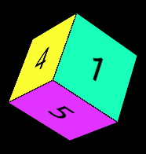

<div align="center">
  <h1>dice-roller.ic</h1>
  
</div>

> Roll some cool virtual dice in this web application powered by the <a href="https://internetcomputer.org">Internet Computer</a> 🎲

---

<br>

## Installation

If you want to develop locally you need to install the dependencies first:

```
npm install
```

## Development

Make sure you have [installed the dependencies](#installation) and then run this command to start developing locally:

```
npm run dev
```

Then open up the browser url that is diplayed in the terminal, for example: [http://localhost:5173/](http://localhost:5173/)

---

🎲 ❤️
